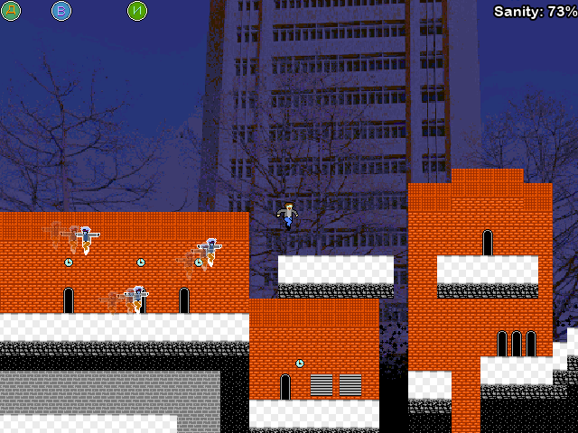
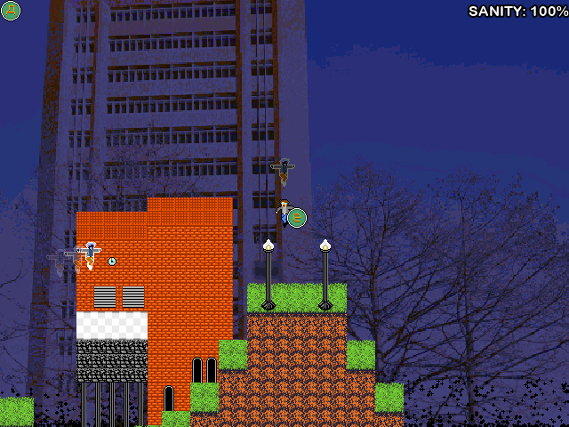

# GDA 2021 November Game Jam Entry
By The Tophat Demon (Xander) with input from Jerrod B.

## Super Lunsford Revengeance

A platformer starring a big dork who wants to collect coins.
But, each coin summons an evil flying shadow clone that will chase him.
Collect all 7 coins to win, or die.

Controls:

Arrow keys - Move

Z or Up - Jump

Running against walls will cause the player to slide down, and pressing
jump at such a moment will do a wall jump.

Made in the span of 1 week using Godot 3.3.1

The actual project is under the 'chase-game' folder.

The code is licensed under GPL3, as detailed in LICENSE.txt

Art assets are licensed under [Creative Commons Attribution 3.0](https://creativecommons.org/licenses/by/3.0/)

If there are any specific questions about how the game works, send a message to TheTophatDemon#8855 on Discord.
